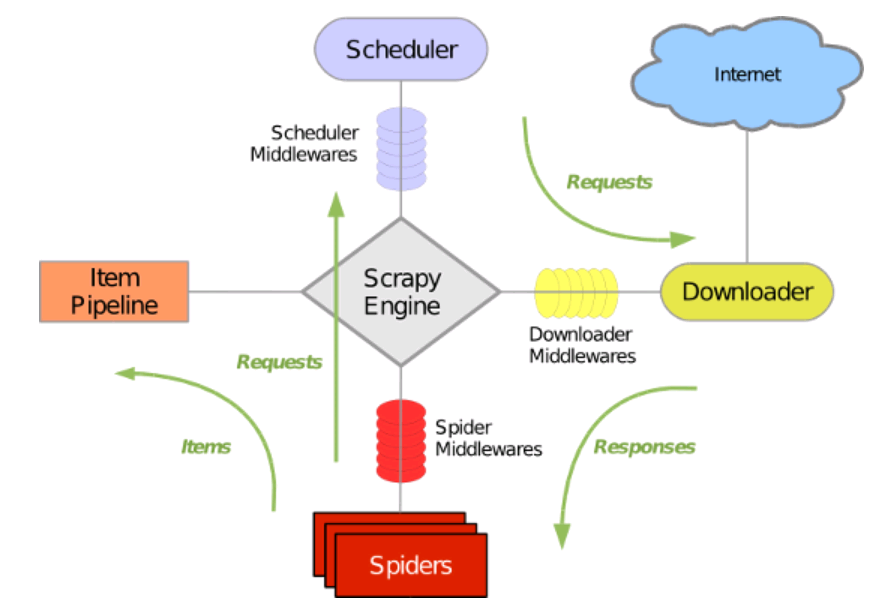
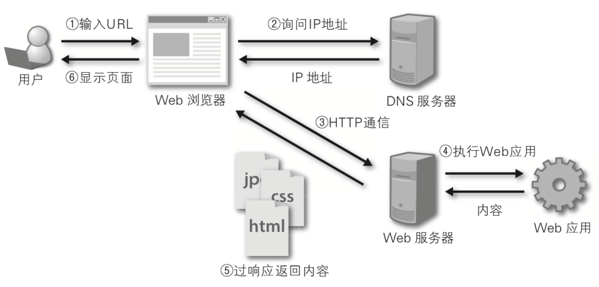
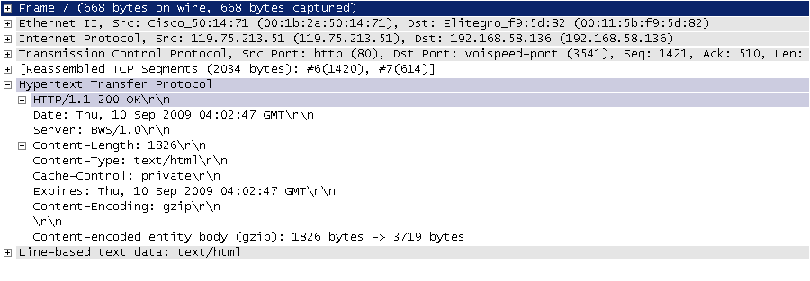
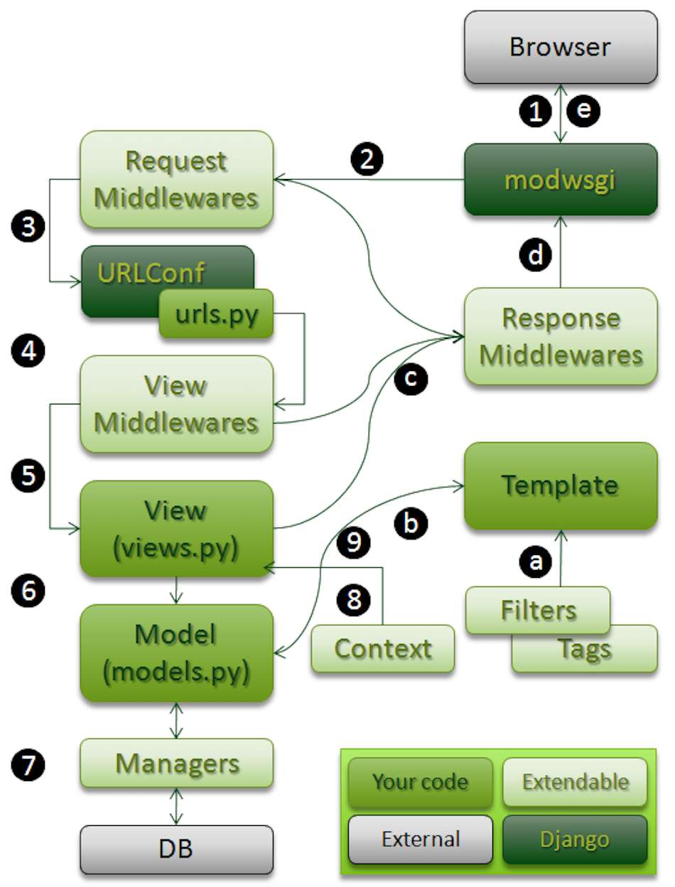
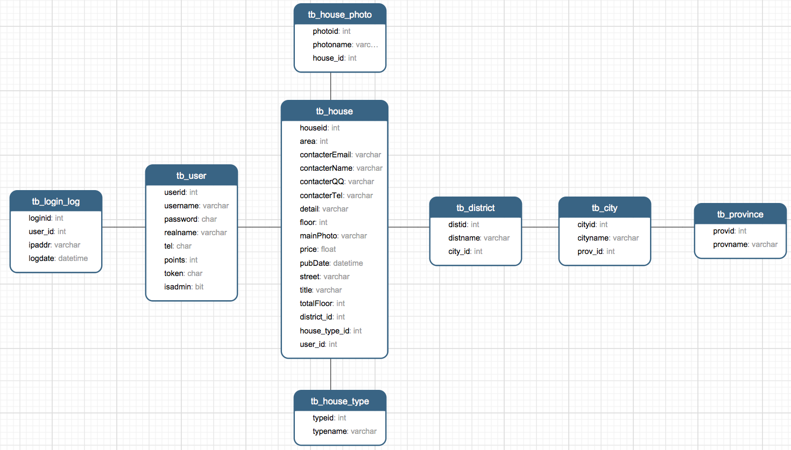
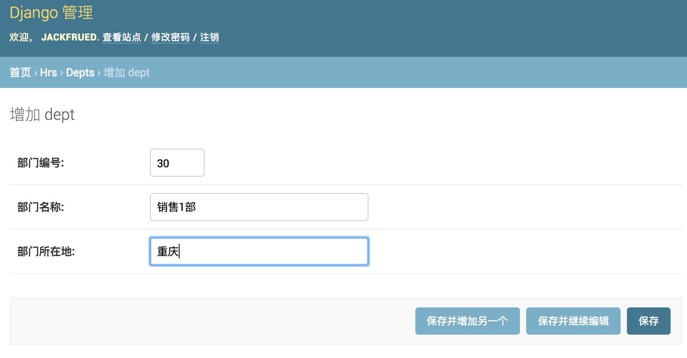
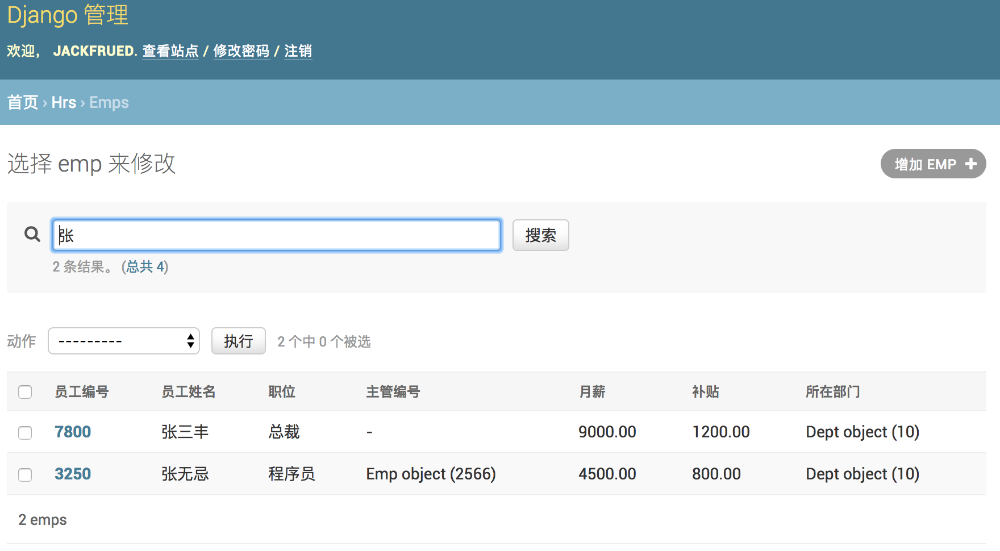

## Python -- 从新手到大师100天(开发环境Pycharm，文本 markdown)
> 作者：Jam
> 联系： 1248659692@qq.com

## 伟大的程序员都有三个优点：**懒惰、暴躁和自负**
1. **懒惰**会促使程序员去写一些省事儿的程序来辅助自己或别人更好的完成工作，这样我们就无需做那些重复和繁琐的劳动；同理能够用3行代码解决的事情，我们也绝不会写出10行代码来。
2. **暴躁**会让程序员主动的去完成一些你还没有提出的工作，去优化自己的代码让它更有效率，能够3秒钟完成的任务，我们绝不能容忍1分钟的等待。
3. **自负**会促使程序员写出可靠无误的代码，我们写代码不是为了接受批评和指责，而是为了让其他人来膜拜。 

## Python 用武之地
 - 云基础设施 - Python / Java / Go
 - DevOps - Python / Shell / Ruby / Go
 - 网络爬虫 - Python / PHP / C++
 - 数据分析挖掘 - Python / R / Scala / Matlab
 - 机器学习 - Python / R / Java / Lisp

## Python 就业领域包括：

- Python服务器后台开发 / 游戏服务器开发 / 数据接口开发工程师
- Python自动化运维工程师
- Python数据分析 / 数据可视化 / 大数据工程师
- Python爬虫工程师
- Python聊天机器人开发 / 图像识别和视觉算法 / 深度学习工程师

## Python 初学者的几个建议：

- Make English as your working language.
- Practice makes perfect.
- All experience comes from mistakes.
- Don't be one of the leeches.
- Either stand out or kicked out.
- 
## Python 初学者的推荐阅读：
- [《谈谈 Python 程序的运行原理》]((http://www.cnblogs.com/restran/p/4903056.html))
- [《Python整数对象实现原理》](https://foofish.net/python_int_implement.html)
- [PythonTutor网站](http://www.pythontutor.com/)
- [PEP 8链接](https://www.python.org/dev/peps/pep-0008/)

## Python语言基础
### 学习心态（**精读1本书胜于泛读10本**）
1. 爬虫框架：  Scrapy(研究透一种)
2. web开发框架： django(研究透一种)
3. Machine Learning框架：  TensorFlow(研究透一种)

## Python参考书籍

### 入门读物

1. 《Python基础教程》（*Beginning Python From Novice to Professional*）
2. 《Python学习手册》（*Learning Python*）
3. 《Python编程》（*Programming Python*）
4. 《Python Cookbook》
5. 《Python程序设计》（*Python Programming: An Introduction to Computer Science*）
6. 《Modern Python Cookbook》

### 进阶读物

1. 《Python核心编程》（*Core Python Applications Programming*）
2. 《流畅的Python》（*Fluent Python*）
3. 《Effective Python：编写高质量Python代码的59个有效方法》（*Effective Python 59 Specific Ways to Write Better Python*）
4. 《Python设计模式》（*Learning Python Design Patterns*）
5. 《Python高级编程》（*Expert Python Programming*）
6. 《Python性能分析与优化》（*Mastering Python High Performance*）

### Web框架

1. 《Django基础教程》（*Tango with Django*）
2. 《轻量级Django》（*Lightweight Django*）
3. 《Python Web开发：测试驱动方法》（*Test-Driven Development with Python*）
4. 《Web Development with Django Cookbook》
5. 《Test-Driven Development with Django》
6. 《Django Project Blueprints 》
7. 《Flask Web开发：基于Python的Web应用开发实战》（*Flask Web Development: Developing Web Applications with Python*）
8. 《深入理解Flask》（*Mastering Flask*）

### 爬虫开发

1. 《用Python写网络爬虫》（*Web Scraping with Python*）
2. 《精通Python爬虫框架Scrapy》（*Learning Scrapy*）
3. 《Python网络数据采集》（*Web Scraping with Python*）
4. 《Python爬虫开发与项目实战》
5. 《Python 3网络爬虫开发实战》

### 数据分析

1. 《利用Python进行数据分析》（*Python for Data Analysis*）
2. 《Python数据科学手册》（*Python Data Science Handbook*）
3. 《Python金融大数据分析》（*Python for Finance*）
4. 《Python数据可视化编程实战》（*Python Data Visualization Cookbook*）
5. 《Python数据处理》（*Data Wrangling with Python*）

### 机器学习

1. 《Python机器学习基础教程》（*Introduction to Machine Learning with Python*）
2. 《Python机器学习实践指南》（*Python Machine Learning Blueprints*）
3. 《Python Machine Learning Case Studies》
4. 《Python机器学习实践：测试驱动的开发方法》（*Thoughtful Machine Learning with Python A Test Driven Approach*）
5. 《Python机器学习经典实例》（*Python Machine Learning Cookbook*）
6. 《TensorFlow：实战Google深度学习框架》

## Python 代码编写格式与规范
## 代码编写过程中的需要注意事项：
	0.PEP是Python Enhancement Proposal的缩写，通常翻译为“Python增强提案”
	1.类总是使用驼峰格式命名,即所有单词首字母大写其余字母小写,类名应该简明,精确,并足以从中理解类所完成的工作
	2.一行列数 : PEP 8 规定为 79 列,这有些苛刻了。根据自己的情况,比如不要超过满屏时编辑器的显示列数。这样就可以在不动水平游标的情况下,方便的查看代码。
	3.一个函数 : 不要超过 30 行代码, 即可显示在一个屏幕类,可以不使用垂直游标即可看到整个函数。
	4.一个类 : 不要超过 200 行代码,不要有超过 10 个方法。
	5.一个模块 不要超过 500 行。
	6.有时间多看看 PEP 8 和google Python代码规范

####  [Python PEP 8](https://www.python.org/dev/peps/pep-0008/)
#### Python 空格的使用

		1. 使用空格来表示缩进而不要用制表符。这一点对习惯了其他编程语言的人来说简直觉得不可理喻，因为绝大多数的程序员都会用Tab来表示缩进，
		   但是要知道Python并没有像C/C++或Java那样的用花括号来构造一个代码块的语法，在Python中分支和循环结构都使用缩进来表示哪些代码属于
		   同一个级别，鉴于此Python代码对缩进以及缩进宽度的依赖比其他很多语言都强得多。在不同的编辑器中，Tab的宽度可能是2、4或8个字符，
		   甚至是其他更离谱的值，用Tab来表示缩进对Python代码来说可能是一场灾难。
		2. 和语法相关的每一层缩进都用4个空格来表示。
		3. 每行的字符数不要超过79个字符，如果表达式因太长而占据了多行，除了首行之外的其余各行都应该在正常的缩进宽度上再加上4个空格。
		4. 函数和类的定义，代码前后都要用两个空行进行分隔。
		5. 在同一个类中，各个方法之间应该用一个空行进行分隔。
		6. 二元运算符的左右两侧应该保留一个空格，而且只要一个空格就好。

#### Python 标识符命名
		1. 变量、函数和属性应该使用小写字母来拼写，如果有多个单词就使用下划线进行连接。
		2. 类中受保护的实例属性，应该以一个下划线开头。
		3. 类中私有的实例属性，应该以两个下划线开头。
		4. 类和异常的命名，应该每个单词首字母大写。
		5. 模块级别的常量，应该采用全大写字母，如果有多个单词就用下划线进行连接。
		6. 类的实例方法，应该把第一个参数命名为`self`以表示对象自身。
		7. 类的类方法，应该把第一个参数命名为`cls`以表示该类自身。

#### Python 表达式和语句
		1. 采用内联形式的否定词，而不要把否定词放在整个表达式的前面。例如`if a is not b`就比`if not a is b`更容易让人理解。
		2. 不要用检查长度的方式来判断字符串、列表等是否为`None`或者没有元素，应该用`if not x`这样的写法来检查它。
		3. 就算`if`分支、`for`循环、`except`异常捕获等中只有一行代码，也不要将代码和`if`、`for`、`except`等写在一起，分开写才会让代码更清晰。
		4. `import`语句总是放在文件开头的地方。
		5. 引入模块的时候，`from math import sqrt`比`import math`更好。
		6. 如果有多个`import`语句，应该将其分为三部分，从上到下分别是Python标准模块、第三方模块和自定义模块，每个部分内部应该按照模块名称的字母表顺序来排列。

### Python 运算符

Python支持多种运算符，下表大致按照优先级从高到低的顺序列出了所有的运算符，我们会陆续使用到它们。

	| 运算符                                                       | 描述                           |
	| ------------------------------------------------------------ | ------------------------------ |
	| `[]` `[:]`                                                   | 下标，切片                     |
	| `**`                                                         | 指数                           |
	| `~` `+` `-`                                                  | 按位取反, 正负号               |
	| `*` `/` `%` `//`                                             | 乘，除，模(取余)，整除               |
	| `+` `-`                                                      | 加，减                         |
	| `>>` `<<`                                                    | 右移，左移                     |
	| `&`                                                          | 按位与                         |
	| `^` `|`                                                      | 按位异或，按位或               |
	| `<=` `<` `>` `>=`                                            | 小于等于，小于，大于，大于等于 |
	| `==` `!=`                                                    | 等于，不等于                   |
	| `is`  `is not`                                               | 身份运算符                     |
	| `in` `not in`                                                | 成员运算符                     |
	| `not` `or` `and`                                             | 逻辑运算符                     |
	| `=` `+=` `-=` `*=` `/=` `%=` `//=` `**=` `&=` `|=` `^=` `>>=` `<<=` | （复合）赋值运算符             |

## Python语言进阶

### 数据结构和算法

#### EAFP优于LBYL
   **EAFP** - **E**asier to **A**sk **F**orgiveness than **P**ermission.

	   d = {'x': '5'}
	   try:
	       value = int(d['x'])
	       print(value)
	   except (KeyError, TypeError, ValueError):
	       value = None
	EAFP，业务逻辑代码跟防御代码隔离的比较清晰，更容易让开发者专注于业务逻辑。

   **LBYL** - **L**ook **B**efore **Y**ou **L**eap.

	   d = {'x': '5'}
	   if 'x' in d and isinstance(d['x'], str) \
	   		and d['x'].isdigit():
	       value = int(d['x'])
	       print(value)
	   else:
	       value = None
	
	LBYL，容易打乱思维，本来业务逻辑用一行代码就可以搞定的。防御性的代码跟业务逻辑混在一块降低了可读性。


#### 使用生成式（用股票价格大于100元的股票构造一个新的字典）
	prices = {
	    'AAPL': 191.88,
	    'GOOG': 1186.96,
	    'IBM': 149.24,
	    'ORCL': 48.44,
	    'ACN': 166.89,
	    'FB': 208.09,
	    'SYMC': 21.29
	}

	prices2 = {key: value for key, value in prices.items() if value > 100}
	print(prices2)

#### 嵌套的列表

	names = ['关羽', '张飞', '赵云', '马超', '黄忠']
    courses = ['语文', '数学', '英语']
    # 录入五个学生三门课程的成绩
    # 错误 - 参考http://pythontutor.com/visualize.html#mode=edit
    # scores = [[None] * len(courses)] * len(names)
    scores = [[None] * len(courses) for _ in range(len(names))]
    for row, name in enumerate(names):
        for col, course in enumerate(courses):
            scores[row][col] = float(input(f'请输入{name}的{course}成绩: '))
    print(scores)

#### heapq、itertools等的用法
	import heapq	

    list1 = [34, 25, 12, 99, 87, 63, 58, 78, 88, 92]
    list2 = [
        {'name': 'IBM', 'shares': 100, 'price': 91.1},
        {'name': 'AAPL', 'shares': 50, 'price': 543.22},
        {'name': 'FB', 'shares': 200, 'price': 21.09},
        {'name': 'HPQ', 'shares': 35, 'price': 31.75},
        {'name': 'YHOO', 'shares': 45, 'price': 16.35},
        {'name': 'ACME', 'shares': 75, 'price': 115.65}
    ]
    print(heapq.nlargest(3, list1))
    print(heapq.nsmallest(3, list1))
    print(heapq.nlargest(2, list2, key=lambda x: x['price']))
    print(heapq.nlargest(2, list2, key=lambda x: x['shares']))

#### 排列 / 组合 / 笛卡尔积
	import itertools

    for val in itertools.permutations('ABCD'):
        print(val)
    print('-' * 50)
    for val in itertools.combinations('ABCDE', 3):
        print(val)
    print('-' * 50)
    for val in itertools.product('ABCD', '123'):
        print(val)

#### collections模块下的工具类(重要)
	from collections import Counter

    words = [
        'look', 'into', 'my', 'eyes', 'look', 'into', 'my', 'eyes',
        'the', 'eyes', 'the', 'eyes', 'the', 'eyes', 'not', 'around',
        'the', 'eyes', "don't", 'look', 'around', 'the', 'eyes',
        'look', 'into', 'my', 'eyes', "you're", 'under'
    ]
    counter = Counter(words)
    print(counter.most_common(3))

#### 穷举法、贪婪法、分治法、动态规划
    # 公鸡5元一只 母鸡3元一只 小鸡1元三只
    # 用100元买100只鸡 问公鸡/母鸡/小鸡各多少只
    for x in range(20):
        for y in range(33):
            z = 100 - x - y
            if 5 * x + 3 * y + z // 3 == 100 and z % 3 == 0:
                print(x, y, z)
    # A、B、C、D、E五人在某天夜里合伙捕鱼 最后疲惫不堪各自睡觉
    # 第二天A第一个醒来 他将鱼分为5份 扔掉多余的1条 拿走自己的一份
    # B第二个醒来 也将鱼分为5份 扔掉多余的1条 拿走自己的一份
    # 然后C、D、E依次醒来也按同样的方式分鱼 问他们至少捕了多少条鱼
    fish = 1
    while True:
        total = fish
        enough = True
        for _ in range(5):
            if (total - 1) % 5 == 0:
                total = (total - 1) // 5 * 4
            else:
                enough = False
                break
        if enough:
            print(fish)
            break
        fish += 1
	
	#动态规划 - 适用于有重叠子问题和最优子结构性质的问题
	#使用动态规划方法所耗时间往往远少于朴素解法(用空间换取时间)

	def fib(num, temp={}):
    """用递归计算Fibonacci数"""
	    if num in (1, 2):
	        return 1
	    try:
	        return temp[num]
	    except KeyError:
	        temp[num] = fib(num - 1) + fib(num - 2)
	        return temp[num]

### 面向对象相关知识

	#三大支柱：封装、继承、多态
	#月薪结算系统
	#部门经理每月15000 程序员每小时200 销售员1800底薪+销售额5%提成
	
	from abc import ABCMeta, abstractmethod

	class Employee(metaclass=ABCMeta):
	      def __init__(self, name):
	          self._name = name
	  
	      @property
	      def name(self):
	          return self._name
	  
	      @abstractmethod
	      def get_salary(self):
	          pass
	  
	  
	  class Manager(Employee):
	      def get_salary(self):
	          return 15000.0
	  
	  
	  class Programmer(Employee):
	      def __init__(self, name):
	          self._working_hour = 0
	          super().__init__(name)
	  
	      @property
	      def working_hour(self):
	          return self._working_hour
	  
	      @working_hour.setter
	      def working_hour(self, hour):
	          self._working_hour = hour if hour > 0 else 0
	  
	      def get_salary(self):
	          return 200.0 * self.working_hour
	  
	  
	  class Salesman(Employee):
	      def __init__(self, name):
	          self._sales = 0.0
	          super().__init__(name)
	  
	      @property
	      def sales(self):
	          return self._sales
	  
	      @sales.setter
	      def sales(self, sales):
	          self._sales = sales if sales > 0 else 0
	  
	      def get_salary(self):
	          return 1800.0 + self.sales * 0.05
	  
	  
	  def main():
	      emps = [
	          Manager(u"刘备"), Manager(u"曹操"), Programmer(u"许褚"),
	          Salesman(u"貂蝉"), Salesman(u"赵云"), Programmer(u"张辽"),
	          Programmer(u"关羽"), Programmer(u"周瑜")
	      ]
	      for emp in emps:
	          if isinstance(emp, Programmer):
	              emp.working_hour = int(input(u"本月工作时间: "))
	          elif isinstance(emp, Salesman):
	              emp.sales = float(input(u"本月销售额: "))
	          print("%s: %.2f" % (emp.name, emp.get_salary()))

### 函数的使用方式

	将函数视为“一等公民”
	高阶函数的用法（filter、map以及它们的替代品）
	位置参数、可变参数、关键字参数、命名关键字参数
	参数的元信息（代码可读性问题）
	匿名函数和内联函数的用法（lambda函数）
	闭包和作用域问题（LEGB）
	装饰器函数（使用装饰器和取消装饰器）
	输出函数执行时间的装饰器。

#### 计算机图像相关知识
	1. 颜色。如果你有使用颜料画画的经历，那么一定知道混合红、黄、蓝三种颜料可以得到其他的颜色，
		事实上这三种颜色就是被我们称为美术三原色的东西，它们是不能再分解的基本颜色。在计算机中，我们可以将红、
		绿、蓝三种色光以不同的比例叠加来组合成其他的颜色，因此这三种颜色就是色光三原色，
		所以我们通常会将一个颜色表示为一个RGB值或RGBA值（其中的A表示Alpha通道，它决定了透过这个图像的像素，也就是透明度）。
	2. 像素。对于一个由数字序列表示的图像来说，最小的单位就是图像上单一颜色的小方格，这些小方块都有一个明确的位置和被分配的色彩数值，
		而这些一小方格的颜色和位置决定了该图像最终呈现出来的样子，它们是不可分割的单位，我们通常称之为像素（pixel）。
		每一个图像都包含了一定量的像素，这些像素决定图像在屏幕上所呈现的大小。

#### 用Pillow操作图像

	1.剪裁图片
	2.调整图片大小
	3.旋转和翻转
	4.操作像素
	5.添加水印

### 处理Excel电子表格[官方文档](https://openpyxl.readthedocs.io/en/stable/#)。

	Python的OpenPyXL模块让我们可以在Python程序中读取和修改Excel电子表格。
	关于OpenPyXL的使用手册和使用文档可以查看它的文档
	

### 处理Word文档

	| 属性          | 描述       |
	| ------------- | ---------- |
	| bold          | 粗体       |
	| italic        | 斜体       |
	| underline     | 下划线     |
	| strike        | 删除线     |
	| double_strike | 双删除线   |
	| all_caps      | 大写首字母 |
	| small_caps    | 大写首字母 |
	| shadow        | 带阴影     |
	| outline       | 轮廓显示   |
	| rtl           | 从右向左   |
	| imprint       | 凹嵌页面   |
	| emboss        | 凸出页面   |

### 处理PDF文档

	PDF是Portable Document Format的缩写，使用.pdf作为文件扩展名

## 数据分析与数据挖掘学习总结

### Python数据分析思路总结：

	0.提出问题(准确描述问题和分析问题,为数据分析的主体思路)
	1.数据采集
	2.原始数据完整性检查
		python缺失值有3种：	（None,NA,NaN）
			1）Python内置的None值  None的数据类型 <class 'NoneType'>
			2）在pandas中,将缺失值表示为NA,表示不可用not available  NaN的数据类型 <class 'float'>
			3）对于数值数据,pandas使用浮点值NaN（Not a Number）表示缺失数据。
	3.数据清洗、整理（缺、误、多,数据处理过程中40-60%时间处于数据清洗）
		1).检查数据
				读入数据中的第一步，就是检查数据，看看都有哪些变量，这些变量分布如何，是不是存在错误的观测。
		2).缺失值处理
				处理缺失值方法可分为3类：删除记录、数据插补和不处理
				缺失是随机发生的吗？如果是，可以用中位数/众数进行填充，也可以使用均值填充。
				或者说缺失其实是有潜在发生机制的吗？比如年龄大的人在问卷调查中更不愿意透露年龄，这样关于年龄的缺失就不是随机发生的，如果使用均值或者中位数进行填补可能会产生很大偏差。这时需要利用年龄和其他自变量的关系对缺失值进行估计。比如可以基于那些没有缺失值的数据来建模，然后拟合模型预测缺失值。
				如果建模的目的是预测，大部分情况下不会很严格地研究缺失机制（缺失机制很明显的时候除外），在缺失机制不太清楚的情况下，可以当成随机缺失进行填补（使用均值中位数或者用K-近邻）
		3).异常值处理
				样本量大，不在乎这几个样本，那么就可以删除这些不合理的值
				样本量小，并且获取这些数据不易而且不能删除，那就先把这些值设为缺失状态
		4).数据集成
				数据集成是将多个数据源合并存放在一个一致的数据存储中的过程
				实体识别
					实体识别的任务是统一不同源数据的矛盾
				同名异义
					数据源A中的属性ID和数据源B中的属性ID分别描述的是菜品编号和订单编号，即描述的是不同的实体
				异名同义
					数据源A中的sales_dt 和数据源B中的sales_date 都是描述销售日期的
				单位不统一
					描述同一个实体分别用的是国际单位和中国传统的计量单位。
				冗余属性识别
					数据集成往往导致数据冗余，例如：
					1.同一属性多次出现
					2.同一属性命名不一致导致重复
					对于冗余属性要先分析，检测到后再将其删除。
					有些冗余属性可以用相关性分析检测。给定两个数值型的属性A和B，根据其属性值 ，用相关系数度量一个属性在多大程度上蕴含另一个属性
		5).数据变换
				数据变换主要是对数据进行规范化处理，将数据转换成“适当的”形式，以适用于挖掘任务及算法的需要
				中心化、标准化，数据规范化对于基于距离的挖掘算法尤为重要
					中心化是通过将变量的每个观测减去该变量均值，这样中心化后的变量观测值为0。
					标准化是将变量观测除以变量标准差，标准化后的变量标准差为1
				规范化（归一化）
					为了消除指标之间的量纲和取值范围差异的影响，需要进行标准化处理，将数据按照比例进行缩放，使之落入一个特定的区域，便于进行综合分析
				1.最小-最大规范化
					最小-最大规范化也称为离差标准化，是对原始数据的线性变换，将数据值映射到[0, 1]之间
				2.零-均值规范化
					零-均值规范化也称为标准差标准化，经过处理的数据的均值为0，标准差为1
				3.小数标定规范化
					通过移动属性值的小数位数，将属性值映射到[-1, 1]之间，移动的小数位数取决于属性值绝对值的最大值
		6).数据规约
				数据规约的意义在于：
					降低无效、错误数据对建模的影响，提高建模的准确性
					少量且具有代表性的数据将大幅缩减数据挖掘所需的时间
					降低存储数据的成本
				属性规约
					属性规约的目标是寻找 出最小的属性子集并确保新数据子集的概率分布尽可能地接近原来数据集的概率分布。属性规约常用的有一下几种方法：
					合并属性：将旧属性合并为新属性
					逐步向前选择
					逐步向后删除
					决策树归纳：用决策树对原始数据进行建模，没有出现在这个决策树上的属性均可认为是无关属性。
					主成分分析
				数值规约指通过选择替代的、较小的数据来减少数据量。常用方法有:
					直方图法
					聚类
					抽样
				 	聚类抽样
				 	分层抽样
					参数回归
		7).变量表示
 	4.从不同角度对数据进行分析,构建模型
    （模型需要业务知识、算法+数据结构知识、python应用等共同建立,模型的建立需要经验的积累,同样也需要技术的学习。数据的好坏决定的数据分析结果的下限,而模型的优劣则决定了上限。）
	5.数据可视化（可视化的结果并不一定要有多炫酷,而是要让看得人可以花最少的时间,就可以领会到图表索要展示的信息）
	6.汇总报告(词云，数据可视化图表)


## Python爬虫相关思路：

### 爬取验证过程：
	 1.use_agent  模拟浏览器,会用到fake模块,生成浏览器use_agent 列表
	 2.IP proxy (常用代理免费代理,西刺,代理获取后还需要验证代理的有效性)
	 3.cookies_pool,高并发,海量数据爬取,并应用redis 存储,当然也会出现cookie的失效与验证
	 4.验证码的处理,常用有走相关扫码平台（云扫码后台人工处理或者图片验证码API）

### 验证码类型：
		1.常见数字与字母组成,直接通过机器识别,正确率95% 图片灰度变成纯白,图片每个字符的切割识别
		2.逻辑计算
		3.词语识别
		4.图片块的移动,selenium
		4.图片识别与点击 12306
### 爬取页面分析过程：
		1.网页静态页面  request+beautifulsoup,对于表格类的数据爬取直接采用pandas read_HTML直接获取数据的dataframe list
		2.动态页面（ajax异步加载） selenium+Xpath（对于需要验证登入的适用）

### 爬取结果与数据清洗存储数据库

### 常用的爬虫框架：scrapy
   
#### Scrapy主要包括了以下组件：

	引擎(Scrapy): 用来处理整个系统的数据流处理, 触发事务(框架核心)
	调度器(Scheduler): 用来接受引擎发过来的请求, 压入队列中, 并在引擎再次请求的时候返回. 可以想像成一个URL（抓取网页的网址或者说是链接）的优先队列, 由它来决定下一个要抓取的网址是什么, 同时去除重复的网址
	下载器(Downloader): 用于下载网页内容, 并将网页内容返回给蜘蛛(Scrapy下载器是建立在twisted这个高效的异步模型上的)
	爬虫(Spiders): 爬虫是主要干活的, 用于从特定的网页中提取自己需要的信息, 即所谓的实体(Item)。用户也可以从中提取出链接,让Scrapy继续抓取下一个页面
	项目管道(Pipeline): 负责处理爬虫从网页中抽取的实体，主要的功能是持久化实体、验证实体的有效性、清除不需要的信息。当页面被爬虫解析后，将被发送到项目管道，并经过几个特定的次序处理数据。
	下载器中间件(Downloader Middlewares): 位于Scrapy引擎和下载器之间的框架，主要是处理Scrapy引擎与下载器之间的请求及响应。
	爬虫中间件(Spider Middlewares): 介于Scrapy引擎和爬虫之间的框架，主要工作是处理蜘蛛的响应输入和请求输出。
	调度中间件(Scheduler Middewares): 介于Scrapy引擎和调度之间的中间件，从Scrapy引擎发送到调度的请求和响应。


	scrapy: 框架基本按照入口文件加上配置文件进行流程控制（下载器,存储器,request请求数据处理,中间件）
	scrapy_redis：分布式爬虫框架（多台服务器共享以个爬取队列）

#### Scrapy运行流程大概如下：

	1.引擎从调度器中取出一个链接(URL)用于接下来的抓取
	2.引擎把URL封装成一个请求(Request)传给下载器，下载器把资源下载下来，并封装成应答包(Response)
	3.爬虫解析Response
	4.若是解析出实体（Item）,则交给实体管道进行进一步的处理。
	  若是解析出的是链接（URL）,则把URL交给Scheduler等待抓取

## 关系型数据入门

### 关系型数据概述

	1. 数据持久化。
	2. 数据库发展史。
	3. 关系型数据库特点。
	   - 理论基础：集合论和关系代数。
	   - 具体表象：用二维表（有行和列）组织数据。
	   - 编程语言：结构化查询语言（SQL Structured Query Language）。
	4. E-R图。
	   - 实体 - 矩形框
	   - 属性 - 椭圆框
	   - 关系 - 菱形框
	   - 映射 - 1:1 / 1:N / M:N

##### 关系型数据库产品
   - [Oracle](https://www.oracle.com/index.html)
   - [DB2](https://www.ibm.com/analytics/us/en/db2/)
   - [SQL Server](https://www.microsoft.com/en-us/sql-server/)
   - [MySQL](https://www.mysql.com/)
   - [SQLite](https://www.sqlite.org/index.html)

#### 范式理论(需要添加)

#### 数据完整性

	1. 实体完整性 - 每个实体都是独一无二的
	   - 主键 / 唯一约束 / 唯一索引
	2. 引用完整性（参照完整性）
	   - 外键
	3. 域完整性 - 数据是有效的
	   - 数据类型
	   - 非空约束
	   - 默认值约束
	   - 检查约束

## MySQL 性能优化总结

#### MySQL’s Logical Architecture
   

#### MySQL’s Structure
   

	[MYSQL性能优化]
		数据量的大小决定了,需要采用的优化策略
		[用法优化]
			1>数据类型选择只要遵循小而简单的原则就好,内存少
			2>通常来说把可为NULL的列改为NOT NULL不会对性能提升有多少帮助,只是如果计划在列上创建索引,就应该将该列设置为NOT NULL
			3>使用索引的基本情况和索引使用类型[B+Tree(balance平衡二叉树)(主键索引/唯一索引/全文索引/普通索引)]:
				0.主键索引  alter table 表名 add primary key (列名);  alter table 表名 drop primary key 索引名;  字符字段最好不要做主键
				  普通索引  create index 索引名 on 表 (列1,列名2);  alter table 表名 drop index 索引名;
				  唯一索引  create unique index 索引名  on 表名 (列表..);  alter table 表名 drop unique key 索引名;
				  查询索引  show keys from 表名  show index(es) from 表名
				1.MySQL不会使用索引的情况：非独立的列:    id + 1 = 5    id = 4
				2.避免多个范围条件
 		[习惯约束]
			0>查询缓存(SQL_CACHE和SQL_NO_CACHE 参数设置,具体情况具体分析是否开启,对于写密集型应用,不建议开启)
			1>尽量别用select *,需要什么字段就写什么字段,减少通信间数据包的大小和数量,从而加快客户端/服务端通信
			2>子查询劲量不要用,会降低sql的性能
			3>尽量不用 or
			4>not 尽量别用
			5>尽量少 join
			6>避免类型转换
			7>原则上禁用mysql函数,特殊情况再议
	[表]
		[建表]
			字段定义为NOT NULL约束,可以使用0或者空字符串来代替NULL,字段建表的时候要给 default
			字段类型尽量使用最小、最简单的数据类型
   		[拆表]
       	[水平拆分]
       		水平拆分按照行进行拆分,常见的就是分库分表
       	[垂直拆分]
       		垂直拆分按照字段进行拆分,其实就是把组成一行的多个列分开放到不同的表中,与表名称相近的字段放在一张表里面
       	[冗余表]
 		[缓存]
   			MySQL内部：在系统调优参数介绍了相关设置
			数据访问层：比如MyBatis针对SQL语句做缓存，而Hibernate可以精确到单个记录，这里缓存的对象主要是持久化对象Persistence Object
			应用服务层：这里可以通过编程手段对缓存做到更精准的控制和更多的实现策略，这里缓存的对象是数据传输对象Data Transfer Object
			Web层：针对web页面做缓存
			浏览器客户端：用户端的缓存
		[读写分离]
   			从库读主库写，一般不要采用双主或多主引入很多复杂性，尽量采用文中的其他方案来提高性能
		[表分区]
   			最适合的场景数据的时间序列性比较强，则可以按时间来分区
   			分区的类型:  RANGE分区  LIST分区  HASH分区  KEY分区
   			CREATE TABLE members (
				firstname VARCHAR(25) NOT NULL,
				lastname VARCHAR(25) NOT NULL,
				username VARCHAR(16) NOT NULL,
				email VARCHAR(35),
				joined DATE NOT NULL
			)
			PARTITION BY RANGE( YEAR(joined) ) (
				PARTITION p0 VALUES LESS THAN (1960),
				PARTITION p1 VALUES LESS THAN (1970),
				PARTITION p2 VALUES LESS THAN (1980),
				PARTITION p3 VALUES LESS THAN (1990),
				PARTITION p4 VALUES LESS THAN MAXVALUE
			);

		[索引]
   		[limit优化]
   			mysql到了百万级分页是个极限,就算用索引,联合索引,此时需要SQL 写成子查询会更快
		[sort优化]
   			sort_buffer_size和max_length_for_sort_data 参数的相关优化,最好的情况是避免排序,合理利用索引因为索引本身也是有序的
   			MySQL无法使用索引排序的情况：
			1>对不同的索引键做 ORDER BY ：   SELECT * FROM t1 ORDER BY key1, key2;
			2>在非连续的索引键部分上做 ORDER BY：   SELECT * FROM t1 WHERE key2=constant ORDER BY key_part2;
			3>同时使用了 ASC 和 DESC：   SELECT * FROM t1 ORDER BY key_part1 DESC, key_part2 ASC;
			4>用于搜索记录的索引键和做 ORDER BY 的不是同一个：  SELECT * FROM t1 WHERE key2=constant ORDER BY key1;
			5>表索引中的记录是不是按序存储(Extra显示为Using index)：  EXPLAIN SELECT t1 ORDER BY key1;
			6>mysql一次查询只能使用一个索引。如果要对多个字段使用索引,建立复合索引
			7>在ORDER BY操作中,MySQL只有在排序条件不是一个查询条件表达式的情况下才使用索引
 		[联合索引优化]
   		[前缀索引]
   		[hint优化]
   	[引擎]
   			目前广泛使用的是MyISAM和InnoDB两种引擎
   		[MyISAM]
				不支持行锁，读取时对需要读到的所有表加锁，写入时则对表加排它锁
				不支持事务
				不支持外键
				不支持崩溃后的安全恢复
				在表有读取查询的同时，支持往表中插入新纪录
				支持BLOB和TEXT的前500个字符索引，支持全文索引
				支持延迟更新索引，极大提升写入性能
				对于不会进行修改的表，支持压缩表，极大减少磁盘空间占用
   		[InnoDB]
				支持行锁，采用MVCC来支持高并发
				支持事务
				支持外键
				支持崩溃后的安全恢复
				不支持全文索引

	[运维]
   		[数据库部署]
   		[配置]
   		[系统]
   		[硬件]
   			根据MySQL是CPU密集型还是I/O密集型，通过提升CPU和内存、使用SSD，都能显著提升MySQL性能
   		[bin-log]
	[其他tips]
		1>INSERT IGNORE INTO  重复行数提示插入行条数为0
		  INSERT INTO  ON DUPLICATE KEY UPDATE   重复行数用之后的数据更新
		2>OPTIMIZE TABLE只对MyISAM,BDB和InnoDB表起作用,尤其是MyISAM表的作用最为明显。只需要对包含可变长度的文本数据类型的表整理即可
		  OPTIMIZE TABLE运行过程中,MySQL会锁定表,不可随便优化,以免数据库锁定或者重启,风险较大
		  OPTIMIZE TABLE对于InnoDB,可能会显示「 Table does not support optimize, doing recreate + analyze instead」此时需要重启数据库
		3>对查询进行优化,应尽量避免全表扫描,首先应考虑在 where 及 order by 涉及的列上建立索引
		4>应尽量避免在 where 子句中对字段进行 null 值判断以及where 子句中使用!=或<>或or操作符,不做列运算,不用函数和触发器,可根据EXPLAIN来查看是否用了索引还是全表扫描
			select id from t where num is null --->>  select id from t where num=0
			select id from t where num=10 or num=20  --->> select id from t where num in (10,20)
			此表中并没数据  alter table 表名 alter column 字段 set default 0;
			表中已存在数据  update tablename set 字段=0;  alter table 表名 alter column 字段 set default 0;
		5>in 和 not in 也要慎用,能用 between 就不要用 in
			select id from t where num in(1,2,3) --->> select id from t where num between 1 and 3
		6>尽量避免在 where 子句中对字段进行表达式操作
			select id from t where num/2=100 --->> select id from t where num=100*2
		7>索引可以提高select效率,但降低了insert及update的效率,insert 或 update 时有可能会重建索引,一个表的索引数最好不要超过6个,值分布很稀少的字段不适合建索引
		8>尽量使用数字型字段,字符型会降低查询,连接的性能和增加存储开销,处理查询和连接时逐个比较字符串中每一个字符,而对于数字型而言只需要比较一次
		9>尽可能的使用 varchar/nvarchar 代替 char/nchar
		10>临时表并不是不可使用,适当地使用它们可以使某些例程更有效,当需要重复引用大型表或常用表中的某个数据集时,最好使用导出表作为数据集,将数据导出或者创建临时表。
		11>单表不要有太多字段,建议在20以内
		12>避免使用NULL字段,很难查询优化且占用额外索引空间,尽量使用TIMESTAMP而非DATETIME,尽量使用TINYINT、SMALLINT、MEDIUM_INT作为整数类型而非INT,如果非负则加上UNSIGNED

## Python Web 开发总结

### web应用机制和术语
   

### web 开发：
	Web开发的早期阶段，开发者需要手动编写每个页面，例如一个新闻门户网站，每天都要修改它的HTML页面，
	这样随着网站规模和体量的增大，这种方式就变得极度糟糕。为了解决这个问题，开发人员想到了用外部程序来为Web服务器生成动态内容，
	也就是说HTML页面以及页面中的动态内容不再通过手动编写而是通过程序自动生成。最早的时候，这项技术被称为CGI（公共网关接口），
	当然随着时间的推移，CGI暴露出的问题也越来越多，例如大量重复的样板代码，总体性能较为低下等，因此在时代呼唤新英雄的背景下，
	PHP、ASP、JSP这类Web应用开发技术在上世纪90年代中后期如雨后春笋般涌现。通常我们说的Web应用是指通过浏览器来访问网络资源的应用程序，
	因为浏览器的普及性以及易用性，Web应用使用起来方便简单，免除了安装和更新应用程序带来的麻烦，而且也不用关心用户到底用的是什么操作系统，
	甚至不用区分是PC端还是移动端。

### flask web应用
   

### web 应用机制和术语
	| 术语          | 解释                                                         |
	| ------------- | ------------------------------------------------------------ |
	| **URL/URI**   | 统一资源定位符/统一资源标识符，网络资源的唯一标识            |
	| **域名**      | 与Web服务器地址对应的一个易于记忆的字符串名字                |
	| **DNS**       | 域名解析服务，可以将域名转换成对应的IP地址                   |
	| **IP地址**    | 网络上的主机的身份标识，通过IP地址可以区分不同的主机         |
	| **HTTP**      | 超文本传输协议，构建在TCP之上的应用级协议，万维网数据通信的基础 |
	| **反向代理**  | 代理客户端向服务器发出请求，然后将服务器返回的资源返回给客户端 |
	| **Web服务器** | 接受HTTP请求，然后返回HTML文件、纯文本文件、图像等资源给请求者 |
	| **Nginx**    | [反向代理](https://zh.wikipedia.org/wiki/%E5%8F%8D%E5%90%91%E4%BB%A3%E7%9086)
					 [负载均衡](https://zh.wikipedia.org/wiki/%E8%B4%9F%E8%BD%BD%E5%9D%87%E8%A1%A1)
					 [HTTP缓存](https://zh.wikipedia.org/wiki/HTTP%E7%BC%93%E5%AD%98) |

#### HTTP协议

    HTTP（超文本传输协议）是构建于TCP（传输控制协议）之上应用级协议，它利用了TCP提供的可靠的传输服务实现了Web应用中的数据交换。按照维基百科上的介绍，设计HTTP最初的目的是为了提供一种发布和接收[HTML](https://zh.wikipedia.org/wiki/HTML)页面的方法，也就是说这个协议是浏览器和Web服务器之间传输的数据的载体。
    关于这个协议的详细信息以及目前的发展状况，阮一峰老师的[《HTTP 协议入门》](http://www.ruanyifeng.com/blog/2016/08/http.html)、[《互联网协议入门》](http://www.ruanyifeng.com/blog/2012/05/internet_protocol_suite_part_i.html)系列以及[《图解HTTPS协议》](http://www.ruanyifeng.com/blog/2014/09/illustration-ssl.html)进行了解

#### HTTP请求（请求行+请求头+空行+[消息体]）：
   

#### HTTP响应（响应行+响应头+空行+消息体）：
   

### Django概述

    Python的Web框架有上百个，比它的关键字还要多。所谓Web框架，就是用于开发Web服务器端应用的基础设施（通常指封装好的模块和一系列的工具）。
    事实上，即便没有Web框架，我们仍然可以通过socket或[CGI](https://zh.wikipedia.org/wiki/%E9%80%9A%E7%94%A8%E7%BD%91%E5%85%B3%E6%8E%A5%E5%8F%A3)来开发Web服务器端应用，但是这样做的成本和代价在实际开发中通常是不能接受的。通过Web框架，我们可以化繁为简，同时降低创建、更新、扩展应用程序的工作量。Python的Web框架中比较有名的有：Flask、Django、Tornado、Pyramid、Bottle、Web2py、web.py等。

    在基于Python的Web框架中，Django是所有重量级选手中最有代表性的一位，开发者可以基于Django快速的开发可靠的Web应用程序，因为它减少了Web开发中不必要的开销，对常用的设计和开发模式进行了封装，并对MVC架构提供了支持（MTV）。许多成功的网站和App都是基于Django框架构建的，国内比较有代表性的网站包括：知乎、豆瓣网、果壳网、搜狐闪电邮箱、101围棋网、海报时尚网、背书吧、堆糖、手机搜狐网、咕咚、爱福窝、果库等。
   

    Django诞生于2003年，它是一个在真正的应用中成长起来的项目，由劳伦斯出版集团旗下在线新闻网站的内容管理系统（CMS）研发团队编写（主要是Adrian Holovaty和Simon Willison），以比利时的吉普赛爵士吉他手Django Reinhardt来命名，在2005年夏天作为开源框架发布。使用Django能用很短的时间构建出功能完备的网站，因为它代替程序员完成了所有乏味和重复的劳动，剩下真正有意义的核心业务给程序员，这一点就是对DRY（Don't Repeat Yourself）理念的最好践行。
   

### django web 应用的工作流程
   

	0.settings配置
	1.jinjia2 HTML template模板引擎,模板引擎所涉及的模板语言编码
	2.URLS 使用与配置
	3.index 使用与配置
	4.model 设计与使用
	5.form和modelform的使用
	6.django 常用的内置函数

### django web 应用的快速上手

#### Python 环境准备工作

	1. 检查Python环境：Django 1.11需要Python 2.7或Python 3.4以上的版本；Django 2.0需要Python 3.4以上的版本。
	   >>> import sys
	   >>> sys.version
	   >>> sys.version_info

	2. 创建项目文件夹并切换到该目录，例如我们要实例一个OA（办公自动化）项目。
	   $ mkdir oa
	   $ cd oa

	3. 创建并激活虚拟环境。
	   $ python3 -m venv venv
	   $ source venv/bin/activate

	   > 注意：Windows系统下是执行`venv/Scripts/activate.bat`批处理文件。
	
	4. 更新包管理工具pip。
	   (venv)$ python -m pip install --upgrade pip
	   > 注意：请注意终端提示符发生的变化，前面的`(venv)`说明我们已经进入虚拟环境，而虚拟环境下的python和pip已经是Python 3的解释器和包管理工具了。
	
	5. 安装Django。
	   (venv)$ pip install django
	   或指定版本号来安装对应的Django的版本。
	   (venv)$ pip install django==1.11

	6. 检查Django的版本。
	   (venv)$ python -m django --version
	   (venv)$ django-admin --version
	   (venv)$ python
	   >>> import django
	   >>> django.get_version()

	   下图展示了Django版本和Python版本的对应关系，在我们的项目中我们选择了最新的Django 2.0的版本。
	
	   | Django版本 | Python版本              |
	   | ---------- | ----------------------- |
	   | 1.8        | 2.7、3.2、3.3、3.4、3.5 |
	   | 1.9、1.10  | 2.7、3.4、3.5           |
	   | 1.11       | 2.7、3.4、3.5、3.6      |
	   | 2.0        | 3.4、3.5、3.6           |

	7. 使用`django-admin`创建项目，项目命名为oa。
	   (venv)$ django-admin startproject oa.
	
	   > 注意：上面的命令最后的那个点，它表示在当前路径下创建项目。
	
	   执行上面的命令后看看生成的文件和文件夹，作用如下所示：
	   1. `manage.py`： 一个让你用各种方式管理 Django 项目的命令行工具。
	   2. `oa/__init__.py`：一个空文件，告诉 Python 这个目录应该被认为是一个 Python 包。
	   3. `oa/settings.py`：Django 项目的配置文件。
	   4. `oa/urls.py`：Django 项目的 URL 声明，就像你网站的“目录”。
	   5. `oa/wsgi.py`：作为你的项目的运行在 WSGI 兼容的Web服务器上的入口。
	
	8. 启动服务器运行项目。
	   (venv)$ python manage.py runserver
	
	   在浏览器中输入<http://127.0.0.1:8000>访问我们的服务器，效果如下图所示。
	
   
	
	   说明1：刚刚启动的是Django自带的用于开发和测试的服务器，它是一个用纯Python编写的轻量级Web服务器，
			 但它并不是真正意义上的生产级别的服务器，千万不要将这个服务器用于和生产环境相关的任何地方。
	   说明2：用于开发的服务器在需要的情况下会对每一次的访问请求重新载入一遍Python代码。
			 所以你不需要为了让修改的代码生效而频繁的重新启动服务器。然而，一些动作，比如添加新文件，
			 将不会触发自动重新加载，这时你得自己手动重启服务器。
	   说明3：可以通过`python manage.py help`命令查看可用命令列表；在启动服务器时，
			 也可以通过`python manage.py runserver *.*.*.*:** 来指定绑定的IP地址和端口。
	   说明4：可以通过Ctrl+C来终止服务器的运行。
	
	9. 接下来我们进入项目目录oa并修改配置文件settings.py，Django是一个支持国际化和本地化的框架，
		因此刚才我们看到的默认首页也是支持国际化的，我们将默认语言修改为中文，时区设置为Shanghai。
	   (venv)$ cd oa
	   (venv)$ vim settings.py
	   	
	   # 找到设置语言与时区的配置选项
	   # 设置语言代码
	   LANGUAGE_CODE = 'zh-hans'
	   # 设置时区
	   TIME_ZONE = 'Asia/Shanghai'

	
	10. 回到manage.py所在的目录，刷新刚才的页面。
	  (venv)$ cd ..
	  (venv)$ python manage.py runserver
   

#### django 页面创建
	1. 创建名为hrs（人力资源系统）的应用（注：一个项目可以包含多个应用）。
	   (venv)$ python manage.py startapp hrs

	   执行上面的命令会在当前路径下创建hrs目录，其目录结构如下所示：
	
	   	`__init__.py`：一个空文件，告诉 Python 这个目录应该被认为是一个 Python 包。
	   	`admin.py`：可以用来注册模型，让Django自动创建管理界面。
	   	`apps.py`：当前应用的配置。
	   	`migrations`：存放与模型有关的数据库迁移信息。
	    `__init__.py`：一个空文件，告诉 Python 这个目录应该被认为是一个 Python 包。
	   	`models.py`：存放应用的数据模型，即实体类及其之间的关系（MVC/MVT中的M）。
	   	`tests.py`：包含测试应用各项功能的测试类和测试函数。
	   	`views.py`：处理请求并返回响应的函数（MVC中的C，MVT中的V）。

	2. 进入应用目录修改视图文件views.py
	   (venv)$ cd hrs
	   (venv)$ vim views.py
	   
	   from django.http import HttpResponse
	   
	   def index(request):
	       return HttpResponse('<h1>Hello, Django!</h1>')

	3. 在应用目录创建一个urls.py文件并映射URL
	   (venv)$ touch urls.py
	   (venv)$ vim urls.py

	   from django.urls import path
	   from hrs import views
	   
	   urlpatterns = [
	       path('', views.index, name='index'),
	   ]

	   > 说明：上面使用的path函数是Django 2.x中新添加的函数，除此之外还有re_path是支持正则表达式的URL映射函数；
	   	       Django 1.x中是用url函数来设定URL映射。

	4. 切换到项目目录，修改该目录下的urls.py文件，对应用中设定的URL进行合并。
	   (venv) $ cd ..
	   (venv) $ cd oa
	   (venv) $ vim urls.py

	   from django.contrib import admin
	   from django.urls import path, include
	   
	   urlpatterns = [
	       path('admin/', admin.site.urls),
	       path('hrs/', include('hrs.urls')),
	   ]
	
	5. 启动项目并访问应用
	   (venv)$ cd ..
	   (venv)$ python manage.py runserver

	   在浏览器中访问 http://localhost:8000/hrs 
	
	   > 说明：如果想实现远程访问，需要先确认防火墙是否已经打开了8000端口，
	   		  而且需要在配置文件settings.py中修改ALLOWED_HOSTS的设置，添加一个'*'表示允许所有的客户端访问Web应用。
	
	6. 修改views.py生成动态内容。
	   (venv)$ cd hrs
	   (venv)$ vim views.py
	   from io import StringIO
	   from django.http import HttpResponse
	   
	   depts_list = [
	       {'no': 10, 'name': '财务部', 'location': '北京'},
	       {'no': 20, 'name': '研发部', 'location': '成都'},
	       {'no': 30, 'name': '销售部', 'location': '上海'},
	   ]
	   
	   def index(request):
	       output = StringIO()
	       output.write('<html>\n')
	       output.write('<head>\n')
	       output.write('\t<meta charset="utf-8">\n')
	       output.write('\t<title>首页</title>')
	       output.write('</head>\n')
	       output.write('<body>\n')
	       output.write('\t<h1>部门信息</h1>\n')
	       output.write('\t<hr>\n')
	       output.write('\t<table>\n')
	       output.write('\t\t<tr>\n')
	       output.write('\t\t\t<th>部门编号</th>\n')
	       output.write('\t\t\t<th>部门名称</th>\n')
	       output.write('\t\t\t<th>所在地</th>\n')
	       output.write('\t\t</tr>\n')
	       for dept in depts_list:
	           output.write('\t\t<tr>\n')
	           output.write(f'\t\t\t<td>{dept["no"]}</td>\n')
	           output.write(f'\t\t\t<td>{dept["name"]}</td>\n')
	           output.write(f'\t\t\t<td>{dept["location"]}</td>\n')
	           output.write('\t\t</tr>\n')
	       output.write('\t</table>\n')
	       output.write('</body>\n')
	       output.write('</html>\n')
	       return HttpResponse(output.getvalue())
	
	7. 再次使用下面的命令来启动服务器并查看程序的运行结果
	    (venv)$ cd ..
	    (venv)$ python manage.py runserver

#### 使用jinjia2视图模板
	
	上面通过拼接HTML代码的方式生成动态视图的做法在实际开发中无法进行迭代。为了解决这个问题，我们可以提前准备一个模板页，所谓模板页就是一个带占位符的HTML页面，当我们将程序中获得的数据替换掉页面中的占位符时，一个动态页面就产生了。
	
	我们可以用Django框架中template模块的Template类创建模板对象，通过模板对象的render方法实现对模板的渲染。所谓的渲染就是用数据替换掉模板页中的占位符，Django框架通过shortcuts模块的快捷函数render简化了渲染模板的操作，具体的用法如下所示。
	
	1. 先回到manage.py文件所在的目录创建一个templates文件夹。
	   (venv)$ cd ..
	   (venv)$ mkdir templates
	   (venv)$ cd templates

	2. 创建模板页index.html。
	   (venv)$ touch index.html
	   (venv)$ vim index.html

	   <!DOCTYPE html>
	   <html lang="en">
	   <head>
	   	<meta charset="UTF-8">
	   	<title>首页</title>
	   </head>
	   <body>
	   	<h1>部门信息</h1>
	   	<hr>
	   	<table>
	   	    <tr>
	               <th>部门编号</th>
	               <th>部门名称</th>
	               <th>所在地</th>
	           </tr>
	           
	           <tr>
	               <td>{{ dept.no }}</td>
	               <td>{{ dept.name }}</td>
	               <td>{{ dept.location }}</td>
	           <tr>
	           
	       </table>
	   </body>
	   </html>

	   注意在模板页中我们使用了`{{ greeting }}`这样的模板占位符语法，也使用了``这样的模板指令，如果对此不熟悉并不要紧，我们会在后续的内容中进一步的讲解模板的用法。

	3. 回到应用目录，修改views.py文件。
	   (venv)$ cd ..
	   (venv)$ cd hrs
	   (venv)$ vim views.py

	   from django.shortcuts import render
	   
	   depts_list = [
	       {'no': 10, 'name': '财务部', 'location': '北京'},
	       {'no': 20, 'name': '研发部', 'location': '成都'},
	       {'no': 30, 'name': '销售部', 'location': '上海'},
	   ]
	   
	   
	   def index(request):
	       return render(request, 'index.html', {'depts_list': depts_list})

	   需要修改settings.py文件，配置模板文件所在的路径
	
	4. 切换到项目目录修改settings.py文件。
	   (venv)$ cd ..
	   (venv)$ cd oa
	   (venv)$ vim settings.py

	   TEMPLATES = [
	       {
	           'BACKEND': 'django.template.backends.django.DjangoTemplates',
	           'DIRS': [os.path.join(BASE_DIR, 'templates')],
	           'APP_DIRS': True,
	           'OPTIONS': {
	               'context_processors': [
	                   'django.template.context_processors.debug',
	                   'django.template.context_processors.request',
	                   'django.contrib.auth.context_processors.auth',
	                   'django.contrib.messages.context_processors.messages',
	               ],
	           },
	       },
	   ]

	5. 重新运行项目并查看结果。
	   (venv)$ cd ..
	   (venv)$ python manage.py runserver

### django 深入模型
	我们提到了Django是基于MVC架构的Web框架，MVC架构追求的是“模型”和“视图的解耦合。所谓“模型”说得更直白一些就是数据，
	通常也被称作“数据模型”。在实际的项目中，数据模型通常通过数据库实现持久化操作，而关系型数据库在很长一段时间都是持久化的首选方案，
	下面以MySQL为例来说明如何使用关系型数据库来实现持久化操作。

#### django 配置关系型数据库MySQL 
	1. 进入oa文件夹，修改项目的settings.py文件，首先将我们之前创建的应用hrs添加已安装的项目中，然后配置MySQL作为持久化方案。
	   (venv)$ cd oa
	   (venv)$ vim settings.py

	   INSTALLED_APPS = [
	       'django.contrib.admin',
	       'django.contrib.auth',
	       'django.contrib.contenttypes',
	       'django.contrib.sessions',
	       'django.contrib.messages',
	       'django.contrib.staticfiles',
	       'hrs',
	   ]
	   
	   DATABASES = {
	       'default': {
	           'ENGINE': 'django.db.backends.mysql',
	           'NAME': 'oa',
	           'HOST': 'localhost',
	           'PORT': 3306,
	           'USER': 'root',
	           'PASSWORD': '123456',
	       }
	   }
	   
	   在配置ENGINE属性时，常用的可选值包括：
	
	   `'django.db.backends.sqlite3'`：SQLite嵌入式数据库。
	   `'django.db.backends.postgresql'`：BSD许可证下发行的开源关系型数据库产品。
	   `'django.db.backends.mysql'`：转手多次目前属于甲骨文公司的经济高效的数据库产品。
	   `'django.db.backends.oracle'`：甲骨文公司的关系型数据库旗舰产品。
	
	   其他的配置可以参考官方文档中[数据库配置](https://docs.djangoproject.com/zh-hans/2.0/ref/databases/#third-party-notes)的部分。
	
	   NAME属性代表数据库的名称，如果使用SQLite它对应着一个文件，在这种情况下NAME的属性值应该是一个绝对路径；使用其他关系型数据库MySQL，
	   则要配置对应的HOST（主机）、PORT（端口）、USER（用户名）、PASSWORD（口令）等属性。

	2. 安装MySQL客户端工具，Python 3中使用PyMySQL，Python 2中用MySQLdb
	   (venv)$ pip install pymysql

	   如果使用Python 3需要修改**项目**的`__init__.py`文件并加入如下所示的代码，这段代码的作用是将PyMySQL视为MySQLdb来使用，从而避免Django找不到连接MySQL的客户端工具而询问你：“Did you install mysqlclient? ”（你安装了mysqlclient吗？）。

	   import pymysql
	   pymysql.install_as_MySQLdb()

	3. 运行manage.py并指定migrate参数实现数据库迁移，为应用程序创建对应的数据表，当然在此之前需要**先启动MySQL数据库服务器并创建名为oa的数据库**，在MySQL中创建数据库的语句如下所示。
	   drop database if exists oa;
	   create database oa default charset utf8;

	   (venv)$ cd ..
	   (venv)$ python manage.py migrate
	   Operations to perform:
	     Apply all migrations: admin, auth, contenttypes, sessions
	   Running migrations:
	     Applying contenttypes.0001_initial... OK
	     Applying auth.0001_initial... OK
	     Applying admin.0001_initial... OK
	     Applying admin.0002_logentry_remove_auto_add... OK
	     Applying contenttypes.0002_remove_content_type_name... OK
	     Applying auth.0002_alter_permission_name_max_length... OK
	     Applying auth.0003_alter_user_email_max_length... OK
	     Applying auth.0004_alter_user_username_opts... OK
	     Applying auth.0005_alter_user_last_login_null... OK
	     Applying auth.0006_require_contenttypes_0002... OK
	     Applying auth.0007_alter_validators_add_error_messages... OK
	     Applying auth.0008_alter_user_username_max_length... OK
	     Applying auth.0009_alter_user_last_name_max_length... OK
	     Applying sessions.0001_initial... OK

	4. 可以看到，Django帮助我们创建了10张表，这些都是使用Django框架需要的东西，稍后我们就会用到这些表。除此之外，我们还应该为我们自己的应用创建数据模型。如果要在hrs应用中实现对部门和员工的管理，我们可以创建如下所示的数据模型。
	   (venv)$ cd hrs
	   (venv)$ vim models.py

	   from django.db import models
	   
	   class Dept(models.Model):
	       """部门类"""
	       
	       no = models.IntegerField(primary_key=True, db_column='dno', verbose_name='部门编号')
	       name = models.CharField(max_length=20, db_column='dname', verbose_name='部门名称')
	       location = models.CharField(max_length=10, db_column='dloc', verbose_name='部门所在地')
	   
	       class Meta:
	           db_table = 'tb_dept'
	   
	   
	   class Emp(models.Model):
	       """员工类"""
	       
	       no = models.IntegerField(primary_key=True, db_column='eno', verbose_name='员工编号')
	       name = models.CharField(max_length=20, db_column='ename', verbose_name='员工姓名')
	       job = models.CharField(max_length=10, verbose_name='职位')
	       # 自参照完整性多对一外键关联
	       mgr = models.ForeignKey('self', on_delete=models.SET_NULL, null=True, blank=True, verbose_name='主管编号')
	       sal = models.DecimalField(max_digits=7, decimal_places=2, verbose_name='月薪')
	       comm = models.DecimalField(max_digits=7, decimal_places=2, null=True, blank=True, verbose_name='补贴')
	       # 多对一外键关联
	       dept = models.ForeignKey(Dept, db_column='dno', on_delete=models.PROTECT, verbose_name='所在部门')
	   
	       class Meta:
	           db_table = 'tb_emp'
	   ```
	   说明：上面定义模型时使用了字段类及其属性，其中
		     	IntegerField对应数据库中的integer类型，
		   		CharField对应数据库的varchar类型，
		   		DecimalField对应数据库的decimal类型，
		   		ForeignKey用来建立多对一外键关联。
		   		字段属性primary_key用于设置主键，max_length用来设置字段的最大长度，
		   		db_column用来设置数据库中与字段对应的列，verbose_name则设置了Django后台管理系统中该字段显示的名称。

	5. 通过模型创建数据表。
	   (venv)$ cd ..
	   (venv)$ python manage.py makemigrations hrs
	   Migrations for 'hrs':
	     hrs/migrations/0001_initial.py
	       - Create model Dept
	       - Create model Emp
	   (venv)$ python manage.py migrate
	   Operations to perform:
	     Apply all migrations: admin, auth, contenttypes, hrs, sessions
	   Running migrations:
	     Applying hrs.0001_initial... OK

   		执行完数据模型迁移操作之后，可以在通过图形化的MySQL客户端工具查看到E-R图（实体关系图）。

   

#### django 在后台管理模型

	1. 创建超级管理员账号
	   (venv)$ python manage.py createsuperuser
	   Username (leave blank to use 'hao'): jackfrued
	   Email address: jackfrued@126.com
	   Password: 
	   Password (again): 
	   Superuser created successfully.

	2. 启动Web服务器，登录后台管理系统
	   (venv)$ python manage.py runserver

	   访问 http://127.0.0.1:8000/admin，会来到如下图所示的登录界面。
	
   
	
	   登录后进入管理员操作平台
	
   
	
	   至此我们还没有看到之前创建的模型类，需要在应用的admin.py文件中模型进行注册。

	3. 注册模型类
	   (venv)$ cd hrs
	   (venv)$ vim admin.py

	   from django.contrib import admin
	   from hrs.models import Emp, Dept
	   
	   admin.site.register(Dept)
	   admin.site.register(Emp)

	   注册模型类后，就可以在后台管理系统中看到

   

	4. 对模型进行CRUD操作
	
	   可以在管理员平台对模型进行C（新增）D（删除）U（更新） R（查看）操作，如下图所示。
	
	   添加新的部门

   

   	   查看所有部门

   

   	   更新和删除部门。

   

	5. 注册模型管理类。
	
	   再次修改admin.py文件，通过注册模型管理类，可以在后台管理系统中更好的管理模型。
	   from django.contrib import admin
	   
	   from hrs.models import Emp, Dept
	   
	   class DeptAdmin(admin.ModelAdmin):
	   
	       list_display = ('no', 'name', 'location')
	       ordering = ('no', )
	   
	   
	   class EmpAdmin(admin.ModelAdmin):
	   
	       list_display = ('no', 'name', 'job', 'mgr', 'sal', 'comm', 'dept')
	       search_fields = ('name', 'job')
	   
	   
	   admin.site.register(Dept, DeptAdmin)
	   admin.site.register(Emp, EmpAdmin)


   

   
	
	   为了更好的查看模型数据，可以为Dept和Emp两个模型类添加`__str__`魔法方法。

	   from django.db import models
	   
	   
	   class Dept(models.Model):
	       """部门类"""
	      
	       
	       def __str__(self):
	           return self.name
	   
	   
	   class Emp(models.Model):
	       """员工类"""
	       
	       mgr = models.ForeignKey('self', on_delete=models.SET_NULL, null=True, blank=True, verbose_name='直接主管')
	   
	       def __str__(self):
	           return self.name

	
	   修改代码后刷新查看Emp模型的页面，效果如下图所示

   

### django 使用ORM完成模型的CRUD操作

	在了解了Django提供的模型管理平台之后，我们来看看如何从代码层面完成对模型的CRUD（Create / Read / Update / Delete）操作。
	我们可以通过manage.py开启Shell交互式环境，然后使用Django内置的ORM框架对模型进行CRUD操作。

	(venv)$ cd ..
	(venv)$ python manage.py shell
	Python 3.6.4 (v3.6.4:d48ecebad5, Dec 18 2017, 21:07:28) 
	[GCC 4.2.1 (Apple Inc. build 5666) (dot 3)] on darwin
	Type "help", "copyright", "credits" or "license" for more information.
	(InteractiveConsole)
	>>> 
	
	#新增
	>>>
	>>> from hrs.models import Dept, Emp
	>>> dept = Dept(40, '研发2部', '深圳')
	>>> dept.save()
	>
	#更新
	
	>>>
	>>> dept.name = '研发3部'
	>>> dept.save()
	```
	
	#查询
	
	查询所有对象。
	
	>>>
	>>> Dept.objects.all()
	<QuerySet [<Dept: 研发1部>, <Dept: 销售1部>, <Dept: 运维1部>, <Dept: 研发3部>]>

	
	过滤数据

	>>> 
	>>> Dept.objects.filter(name='研发3部') # 查询部门名称为“研发3部”的部门
	<QuerySet [<Dept: 研发3部>]>
	>>>
	>>> Dept.objects.filter(name__contains='研发') # 查询部门名称包含“研发”的部门(模糊查询)
	<QuerySet [<Dept: 研发1部>, <Dept: 研发3部>]>
	>>>
	>>> Dept.objects.filter(no__gt=10).filter(no__lt=40) # 查询部门编号大于10小于40的部门
	<QuerySet [<Dept: 销售1部>, <Dept: 运维1部>]>
	>>>
	>>> Dept.objects.filter(no__range=(10, 30)) # 查询部门编号在10到30之间的部门
	<QuerySet [<Dept: 研发1部>, <Dept: 销售1部>, <Dept: 运维1部>]>
	
	查询单个对象

	>>> 
	>>> Dept.objects.get(pk=10)
	<Dept: 研发1部>
	>>>
	>>> Dept.objects.get(no=20)
	<Dept: 销售1部>
	>>>
	>>> Dept.objects.get(no__exact=30)
	<Dept: 运维1部>

	排序数据

	>>>
	>>> Dept.objects.order_by('no') # 查询所有部门按部门编号升序排列
	<QuerySet [<Dept: 研发1部>, <Dept: 销售1部>, <Dept: 运维1部>, <Dept: 研发3部>]>
	>>>
	>>> Dept.objects.order_by('-no') # 查询所有部门按部门编号降序排列
	<QuerySet [<Dept: 研发3部>, <Dept: 运维1部>, <Dept: 销售1部>, <Dept: 研发1部>]>

	切片数据

	>>>
	>>> Dept.objects.order_by('no')[0:2] # 按部门编号排序查询1~2部门
	<QuerySet [<Dept: 研发1部>, <Dept: 销售1部>]>
	>>>
	>>> Dept.objects.order_by('no')[2:4] # 按部门编号排序查询3~4部门
	<QuerySet [<Dept: 运维1部>, <Dept: 研发3部>]>

	高级查询。

	>>>
	>>> Emp.objects.filter(dept__no=10) # 根据部门编号查询该部门的员工
	<QuerySet [<Emp: 乔峰>, <Emp: 张无忌>, <Emp: 张三丰>]>
	>>>
	>>> Emp.objects.filter(dept__name__contains='销售') # 查询名字包含“销售”的部门的员工
	<QuerySet [<Emp: 黄蓉>]>
	>>>
	>>> Dept.objects.get(pk=10).emp_set.all() # 通过部门反查部门所有的员工
	<QuerySet [<Emp: 乔峰>, <Emp: 张无忌>, <Emp: 张三丰>]>
	
	> 说明1：由于员工与部门之间存在多对一外键关联，所以也能通过部门反向查询该部门的员工（从一对多关系中“一”的一方查询“多”的一方），反向查询属性默认的名字是`类名小写_set`（如上面例子中的`emp_set`），当然也可以在创建模型时通过`ForeingKey`的`related_name`属性指定反向查询属性的名字。如果不希望执行反向查询可以将`related_name`属性设置为`'+'`或以`'+'`开头的字符串。
	
	> 说明2：查询多个对象的时候返回的是QuerySet对象，QuerySet使用了惰性查询，即在创建QuerySet对象的过程中不涉及任何数据库活动，等真正用到对象时（求值QuerySet）才向数据库发送SQL语句并获取对应的结果，这一点在实际开发中需要引起注意！
	
	> 说明3：可以在QuerySet上使用`update()`方法一次更新多个对象。

	#删除

	>>>
	>>> Dept.objects.get(pk=40).delete()
	(1, {'hrs.Dept': 1})

	### Django模型最佳实践
	
	1. 正确的为模型和关系字段命名。
	2. 设置适当的`related_name`属性。
	3. 用`OneToOneField`代替`ForeignKeyField(unique=True)`。
	4. 通过“迁移操作”（migrate）来添加模型。
	5. 用NoSQL来应对需要降低范式级别的场景。
	6. 如果布尔类型可以为空要使用`NullBooleanField`。
	7. 在模型中放置业务逻辑。
	8. 用`<ModelName>.DoesNotExists`取代`ObjectDoesNotExists`。
	9. 在数据库中不要出现无效数据。
	10. 不要对`QuerySet`调用`len()`函数。
	11. 将`QuerySet`的`exists()`方法的返回值用于`if`条件。
	12. 用`DecimalField`来存储货币相关数据而不是`FloatField`。
	13. 定义`__str__`方法。
	14. 不要将数据文件放在同一个目录中。

### django模型定义参考

#### django字段

	对字段名称的限制
	
	- 字段名不能是Python的保留字，否则会导致语法错误
	- 字段名不能有多个连续下划线，否则影响ORM查询操作
	
	Django模型字段类
	
	| 字段类                |  说明                                                         |
	| --------------------- | ------------------------------------------------------------ |
	| AutoField             |自增ID字段                                                   |
	| BigIntegerField       |64位有符号整数                                               |
	| BinaryField           | 存储二进制数据的字段，对应Python的bytes类型                  |
	| BooleanField          | 存储True或False                                              |
	| CharField             | 长度较小的字符串                                             |
	| DateField             | 存储日期，有auto_now和auto_now_add属性                       |
	| DateTimeField         | 存储日期和日期，两个附加属性同上                             |
	| DecimalField          |存储固定精度小数，有max_digits（有效位数）和decimal_places（小数点后面）两个必要的参数 |
	| DurationField         |存储时间跨度                                                 |
	| EmailField            | 与CharField相同，可以用EmailValidator验证                    |
	| FileField             | 文件上传字段                                                 |
	| FloatField            | 存储浮点数                                                   |
	| ImageField            | 其他同FileFiled，要验证上传的是不是有效图像                  |
	| IntegerField          | 存储32位有符号整数。                                         |
	| GenericIPAddressField | 存储IPv4或IPv6地址                                           |
	| NullBooleanField      | 存储True、False或null值                                      |
	| PositiveIntegerField  | 存储无符号整数（只能存储正数）                               |
	| SlugField             | 存储slug（简短标注）                                         |
	| SmallIntegerField     | 存储16位有符号整数                                           |
	| TextField             | 存储数据量较大的文本                                         |
	| TimeField             | 存储时间                                                     |
	| URLField              | 存储URL的CharField                                           |
	| UUIDField             | 存储全局唯一标识符                                           |

#### django字段属性

	通用字段属性
	
	| 选项           | 说明                                                         |
	| -------------- | ------------------------------------------------------------ |
	| null           | 数据库中对应的字段是否允许为NULL，默认为False                |
	| blank          | 后台模型管理验证数据时，是否允许为NULL，默认为False          |
	| choices        | 设定字段的选项，各元组中的第一个值是设置在模型上的值，第二值是人类可读的值 |
	| db_column      | 字段对应到数据库表中的列名，未指定时直接使用字段的名称       |
	| db_index       | 设置为True时将在该字段创建索引                               |
	| db_tablespace  | 为有索引的字段设置使用的表空间，默认为DEFAULT_INDEX_TABLESPACE |
	| default        | 字段的默认值                                                 |
	| editable       | 字段在后台模型管理或ModelForm中是否显示，默认为True          |
	| error_messages | 设定字段抛出异常时的默认消息的字典，其中的键包括null、blank、invalid、invalid_choice、unique和unique_for_date |
	| help_text      | 表单小组件旁边显示的额外的帮助文本。                         |
	| primary_key    | 将字段指定为模型的主键，未指定时会自动添加AutoField用于主键，只读。 |
	| unique         | 设置为True时，表中字段的值必须是唯一的                       |
	| verbose_name   | 字段在后台模型管理显示的名称，未指定时使用字段的名称         |
	
	ForeignKey属性
	
	1. limit_choices_to：值是一个Q对象或返回一个Q对象，用于限制后台显示哪些对象。
	2. related_name：用于获取关联对象的关联管理器对象（反向查询），如果不允许反向，该属性应该被设置为`'+'`，或者以`'+'`结尾。
	3. to_field：指定关联的字段，默认关联对象的主键字段。
	4. db_constraint：是否为外键创建约束，默认值为True。
	5. on_delete：外键关联的对象被删除时对应的动作，可取的值包括django.db.models中定义的：
	   - CASCADE：级联删除。
	   - PROTECT：抛出ProtectedError异常，阻止删除引用的对象。
	   - SET_NULL：把外键设置为null，当null属性被设置为True时才能这么做。
	   - SET_DEFAULT：把外键设置为默认值，提供了默认值才能这么做。
	
	ManyToManyField属性
	
	1. symmetrical：是否建立对称的多对多关系。
	2. through：指定维持多对多关系的中间表的Django模型。
	3. throughfields：定义了中间模型时可以指定建立多对多关系的字段。
	4. db_table：指定维持多对多关系的中间表的表名。

#### django模型元数据选项

	| 选项                  | 说明                                                         |
	| --------------------- | ------------------------------------------------------------ |
	| abstract              | 设置为True时模型是抽象父类                                   |
	| app_label             | 如果定义模型的应用不在INSTALLED_APPS中可以用该属性指定       |
	| db_table              | 模型使用的数据表名称                                         |
	| db_tablespace         | 模型使用的数据表空间                                         |
	| default_related_name  | 关联对象回指这个模型时默认使用的名称，默认为<model_name>_set |
	| get_latest_by         | 模型中可排序字段的名称。                                     |
	| managed               | 设置为True时，Django在迁移中创建数据表并在执行flush管理命令时把表移除 |
	| order_with_respect_to | 标记对象为可排序的                                           |
	| ordering              | 对象的默认排序                                               |
	| permissions           | 创建对象时写入权限表的额外权限                               |
	| default_permissions   | 默认为`('add', 'change', 'delete')`                          |
	| unique_together       | 设定组合在一起时必须独一无二的字段名                         |
	| index_together        | 设定一起建立索引的多个字段名                                 |
	| verbose_name          | 为对象设定人类可读的名称                                     |
	| verbose_name_plural   | 设定对象的复数名称                                           |

### django查询参考

	按字段查找可以用的条件：
	
	1. exact / iexact：精确匹配/忽略大小写的精确匹配查询
	2. contains / icontains / startswith / istartswith / endswith / iendswith：基于`like`的模糊查询
	3. in：集合运算
	4. gt / gte / lt / lte：大于/大于等于/小于/小于等于关系运算
	5. range：指定范围查询（SQL中的`between…and…`）
	6. year / month / day / week_day / hour / minute / second：查询时间日期
	7. isnull：查询空值（True）或非空值（False）
	8. search：基于全文索引的全文检索
	9. regex / iregex：基于正则表达式的模糊匹配查询
	
	Q对象（用于执行复杂查询）的使用：

	>>>
	>>> from django.db.models import Q
	>>> Emp.objects.filter(
	...     Q(name__startswith='张'),
	...     Q(sal__gte=5000) | Q(comm__gte=1000)
	... ) # 查询名字以“张”开头且工资大于等于5000或补贴大于等于1000的员工
	<QuerySet [<Emp: 张三丰>]>

###Deploy flask app with nginx using gunicorn and supervisor：
	Flask: Server backend(web app)
	Nginx: Reverse proxy(static service)
	Gunicorn: Deploy flask app (WSGI Web Server Gateway Interface, 服务器和Python web app 接口)
	Supervisor: Monitor and Control gunicorn process(autorestart and autostart)

## Python 常用模块包总结

###supervisor example
	[command] 
	supervisorctl restart py_efin_web
	supervisorctl reload py_efin_web
	supervisorctl update py_efin_web
	supervisorctd (supervisorct daemon 守护进程)
	
	[program:py_efin_web(program_name)] 
	command=/usr/local/bin/gunicorn --timeout=75 --workers=3  web:app -b 0.0.0.0:5000 
			--access-logfile /opt/code/py_db_mq/data/logs/access_log
	用gunicorn启动命令    等待时间为75s  工作进程数为3  web flask启动的python文件 app flask应用程序实例  
	监听IP与端口  0.0.0.0:5000  accesslogfile 运行日志 errorlog 错误日志
	#use gunicorn conf start
	#command=/usr/local/bin/gunicorn  web:app -c /etc/gunicorn.conf  采用 gunicorn 配置文件启动
	directory=/opt/code/py_db_mq  flask 文件路径
	stopsignal=QUIT  停止
	autostart=true   自动启动
	autorestart=true  自动重新启动
	priority=999   优先级
	stdout_logfile=/opt/code/py_db_mq/data/logs/log_supctl.log  supervisor 运行日志
	stderr_logfile=/opt/code/py_db_mq/data/logs/log_supctl_err.log supervisor errorlog 错误日志

### WSGI & uwsgi & uWSGI 区别
	WSGI：全称是Web Server Gateway Interface，WSGI不是服务器，python模块，框架，API或者任何软件
	WSGI只是一种规范，描述web server如何与web application通信的规范协议
	WSGI规范协议：常用web框架有Bottle, Flask, Django
	uwsgi：与WSGI一样是通信协议，是uWSGI服务器的独占协议，用于定义传输信息的类型(type of information)每一个uwsgi packet前4byte为传输信息类型的描述，与WSGI协议是两种东西，据说该协议是fcgi协议的10倍快
	uWSGI：是一个web服务器，实现了WSGI协议、uwsgi协议、http协议等
	WSGI协议主要包括server和application两部分

### 用gensim进行文本相似度分析原理分析(NLP神器—Gensim generate similarity)

#### Gensim前  言 [API Reference](https://radimrehurek.com/gensim/apiref.html)
    Gensim是一款开源的第三方Python工具包，用于从原始的非结构化的文本中，无监督地学习到文本隐层的主题向量表达。 
    它支持包括TF-IDF，LSA，LDA，和word2vec在内的多种主题模型算法，支持流式训练，并提供了诸如相似度计算，信息检索等一些常用任务的API接口
    
#### 1 基本概念
    语料（Corpus）：一组原始文本的集合，用于无监督地训练文本主题的隐层结构。语料中不需要人工标注的附加信息。在Gensim中，Corpus通常是一个可迭代的对象（比如列表）。每一次迭代返回一个可用于表达文本对象的稀疏向量。
    向量（Vector）：由一组文本特征构成的列表。是一段文本在Gensim中的内部表达。
    稀疏向量（SparseVector）：通常，我们可以略去向量中多余的0元素。此时，向量中的每一个元素是一个(key, value)的元组
    模型（Model）：是一个抽象的术语。定义了两个向量空间的变换（即从文本的一种向量表达变换为另一种向量表达）。

#### 2 分析原理
    1、文本相似度计算的需求始于搜索引擎。
    搜索引擎需要计算“用户查询”和爬下来的众多”网页“之间的相似度，从而把最相似的排在最前返回给用户。
    2、主要使用的算法是tf-idf
    tf：term frequency 词频
    idf：inverse document frequency 倒文档频率
    主要思想是：如果某个词或短语在一篇文章中出现的频率高，并且在其他文章中很少出现，则认为此词或者短语具有很好的类别区分能力，适合用来分类。
    第一步：把每个网页文本分词，成为词包（bag of words）。
    第三步：统计网页（文档）总数M。
    第三步：统计第一个网页词数N，计算第一个网页第一个词在该网页中出现的次数n，再找出该词在所有文档中出现的次数m。则该词的tf-idf 为：n/N * 1/(m/M)  （还有其它的归一化公式，这里是最基本最直观的公式）
    第四步：重复第三步，计算出一个网页所有词的tf-idf 值。
    第五步：重复第四步，计算出所有网页每个词的tf-idf 值。
    3、处理用户查询
    第一步：对用户查询进行分词。
    第二步：根据网页库（文档）的数据，计算用户查询中每个词的tf-idf 值。
    4、相似度的计算
    使用余弦相似度来计算用户查询和每个网页之间的夹角。夹角越小，越相似。

#### 3 实际操作

    步骤一：训练语料的预处理：
    训练语料的预处理指的是将文档中原始的字符文本转换成Gensim模型所能理解的稀疏向量的过程。
    通常，我们要处理的原生语料是一堆文档的集合，每一篇文档又是一些原生字符的集合。在交给Gensim的模型训练之前，
    我们需要将这些原生字符解析成Gensim能处理的稀疏向量的格式。由于语言和应用的多样性，我们需要先对原始的文本进行分词、去除停用词等操作，
    得到每一篇文档的特征列表。例如，在词袋模型中，文档的特征就是其包含的word，其中，corpus的每一个元素对应一篇文档。
    接下来，我们可以调用Gensim提供的API建立语料特征（此处即是word）的索引字典，并将文本特征的原始表达转化成词袋模型对应的稀疏向量的表达。
    依然以词袋模型为例：
    ```
    from gensim import corpora
    dictionary = corpora.Dictionary(texts)
    corpus = [dictionary.doc2bow(text) for text in texts]
    print corpus[0] # [(0, 1), (1, 1), (2, 1)]
    ```
    
    到这里，训练语料的预处理工作就完成了。我们得到了语料中每一篇文档对应的稀疏向量（这里是bow向量）；向量的每一个元素代表了一个word在这篇文档中出现的次数。
    值得注意的是，虽然词袋模型是很多主题模型的基本假设，这里介绍的doc2bow函数并不是将文本转化成稀疏向量的唯一途径。在下一小节里我们将介绍更多的向量变换函数。
    最后，出于内存优化的考虑，Gensim支持文档的流式处理。我们需要做的，只是将上面的列表封装成一个Python迭代器；每一次迭代都返回一个稀疏向量即可。
    
    ```
    class MyCorpus(object):
    def __iter__(self):
        for line in open('mycorpus.txt'):
            # assume there's one document per line, tokens separated by whitespace
            yield dictionary.doc2bow(line.lower().split())
    ```
    
    步骤二：主题向量的变换:
    对文本向量的变换是Gensim的核心。通过挖掘语料中隐藏的语义结构特征，我们最终可以变换出一个简洁高效的文本向量。
    在Gensim中，每一个向量变换的操作都对应着一个主题模型，例如上一小节提到的对应着词袋模型的doc2bow变换。每一个模型又都是一个标准的Python对象。
    下面以TF-IDF模型为例，介绍Gensim模型的一般使用方法。首先是模型对象的初始化。通常，Gensim模型都接受一段训练语料（注意在Gensim中，
    语料对应着一个稀疏向量的迭代器）作为初始化的参数。显然，越复杂的模型需要配置的参数越多。
    ```
    from gensim import models
    tfidf = models.TfidfModel(corpus)
    ```

    其中，corpus是一个返回bow向量的迭代器。这两行代码将完成对corpus中出现的每一个特征的IDF值的统计工作。
    接下来，我们可以调用这个模型将任意一段语料（依然是bow向量的迭代器）转化成TFIDF向量（的迭代器）。需要注意的是，这里的bow向量必须与训练语料的bow向量共享同一个特征字典（即共享同一个向量空间）。

    ```
    doc_bow = [(0, 1), (1, 1)]
    print tfidf[doc_bow] # [(0, 0.70710678), (1, 0.70710678)]
    tfidf.save("./model.tfidf")
    tfidf = models.TfidfModel.load("./model.tfidf")
    ```
    
    注意，同样是出于内存的考虑，model[corpus]方法返回的是一个迭代器。如果要多次访问model[corpus]的返回结果，可以先将结果向量序列化到磁盘上。
    我们也可以将训练好的模型持久化到磁盘上，以便下一次使用：
    Gensim内置了多种主题模型的向量变换，包括LDA，LSI，RP，HDP等。这些模型通常以bow向量或tfidf向量的语料为输入，生成相应的主题向量。
    所有的模型都支持流式计算。
    
    步骤三：文档相似度的计算
    在得到每一篇文档对应的主题向量后，我们就可以计算文档之间的相似度，进而完成如文本聚类、信息检索之类的任务。在Gensim中，也提供了这一类任务的API接口。
    以信息检索为例。对于一篇待检索的query，我们的目标是从文本集合中检索出主题相似度最高的文档。
    首先，我们需要将待检索的query和文本放在同一个向量空间里进行表达（以LSI向量空间为例）：
    
    # 构造LSI模型并将待检索的query和文本转化为LSI主题向量
    # 转换之前的corpus和query均是BOW向量
    ```
    lsi_model = models.LsiModel(corpus, id2word=dictionary,num_topics=2)
    documents = lsi_model[corpus]
    query_vec = lsi_model[query]
    ```
    
    接下来，我们用待检索的文档向量初始化一个相似度计算的对象：
    ```
    index = similarities.MatrixSimilarity(documents)
    index.save('/tmp/test.index')
    index = similarities.MatrixSimilarity.load('/tmp/test.index')
    ```
    意，如果待检索的目标文档过多，使用similarities.MatrixSimilarity类往往会带来内存不够用的问题。此时，可以改用similarities.Similarity类。二者的接口基本保持一致。
    最后，我们借助index对象计算任意一段query和所有文档的（余弦）相似度：
    
    sims = index[query_vec] 
    #返回一个元组类型的迭代器：(idx, sim)
    
####  补充：
    TF-IDF（注意：这里不是减号）是一种统计方法，用以评估一字词对于一个文件集或一个语料库中的其中一份文件的重要程度。 
    字词的重要性随着它在文件中出现的次数成正比增加，但同时会随着它在语料库中出现的频率成反比下降。TF-IDF加权的各种形式常被搜索引擎应用，作为文件与用户查询之间相关程度的度量或评级。 
    1. 一个词预测主题能力越强，权重就越大，反之，权重就越小。我们在网页中看到“原子能”这个词，或多或少地能了解网页的主题。我们看到“应用”一次，对主题基本上还是一无所知。因此，“原子能“的权重就应该比应用大。 
    2. 应删除词的权重应该是零。
    
    LDA文档主题生成模型
    LDA是一种文档主题生成模型，包含词、主题和文档三层结构。
    所谓生成模型，就是说，我们认为一篇文章的每个词都是通过“以一定概率选择了某个主题，并从这个主题中以一定概率选择某个词语”这样一个过程得到。文档到主题服从多项式分布，主题到词服从多项式分布。
    LDA是一种非监督机器学习技术，可以用来识别大规模文档集或语料库中潜藏的主题信息。它采用了词袋的方法，这种方法将每一篇文档视为一个词频向量，从而将文本信息转化为了易于建模的数字信息。
    但是词袋方法没有考虑词与词之间的顺序，这简化了问题的复杂性，同时也为模型的改进提供了契机。每一篇文档代表了一些主题所构成的一个概率分布，而每一个主题又代表了很多单词所构成的一个概率分布。
      


